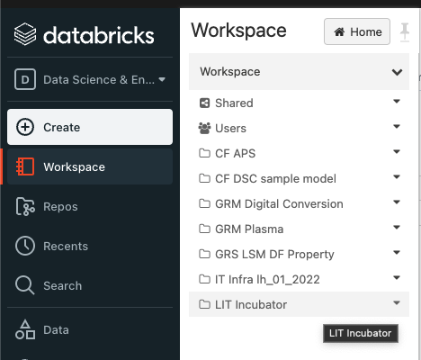
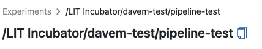
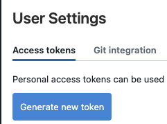
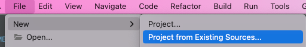
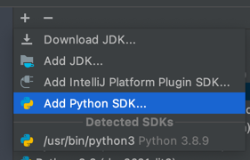
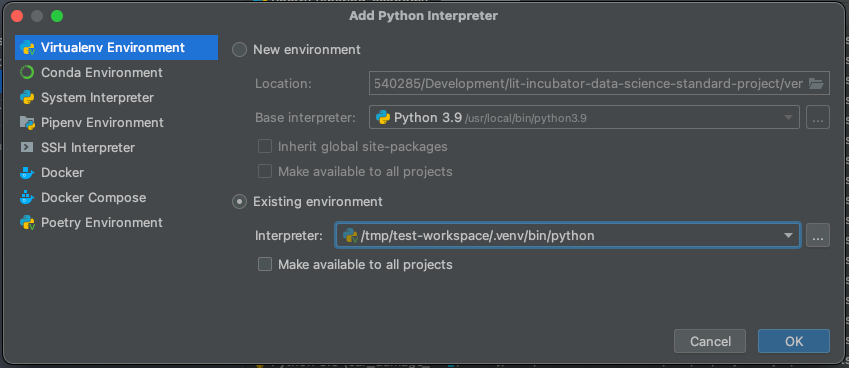
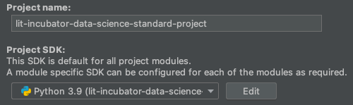

# dsc-im-on-smoko-lit

<!-- forge.header -->
[![CloudForge Console][console_shield]][console_url]
<!-- /forge.header -->

# Table of contents

- [dsc-im-on-smoko-lit](#--forgeartifactname-)
- [Table of contents](#table-of-contents)
- [Directory layout](#directory-layout)
- [Pre-requisites](#pre-requisites)
  - [Databricks Workspace](#databricks-workspace)
  - [Cortex EC2 Prerequisites](#cortex-ec2-prerequisites)
  - [Pipenv](#pipenv)
  - [Pyenv](#pyenv)
    - [Windows considerations](#windows-considerations)
  - [Git](#git)
    - [Windows considerations](#windows-considerations-1)
  - [Data Science CLI utilities](#data-science-cli-utilities)
- [Initial Project Setup](#initial-project-setup)
  - [Clone the git repository](#clone-the-git-repository)
  - [Virtual Environment Setup](#virtual-environment-setup)
  - [Configuration Settings](#configuration-settings)
    - [IntelliJ / Pycharm setup](#intellij--pycharm-setup)
      - [Create New Project](#create-new-project)
      - [Configure the Project to use the existing Virtual Environment](#configure-the-project-to-use-the-existing-virtual-environment)
- [Adding your own code to the pipeline](#adding-your-own-code-to-the-pipeline)
- [Running the pipeline](#running-the-pipeline)
  - [Using ds-cli](#using-ds-cli)
  - [Running directly](#running-directly)
  - [Rewrapping an existing model](#rewrapping-an-existing-model)
- [Running the pipeline via "mlflow run"](#running-the-pipeline-via-mlflow-run)
  - [Environment variables](#environment-variables)
  - [Scenario 1 - Cloning directly from git and running the default endpoint](#scenario-1---cloning-directly-from-git-and-running-the-default-endpoint)
  - [Scenario 2 - Local environment already created via Pipenv](#scenario-2---local-environment-already-created-via-pipenv)
- [Serving the model locally](#serving-the-model-locally)
  - [Example input](#example-input)
- [Unit Tests](#unit-tests)
  - [Integration Tests](#integration-tests)
- [Code Quality](#code-quality)
  - [Configuration](#configuration)

This project was generated using the **[Data Science Model Pipeline Template](https://github.com/lmigtech/Data-Science-Model-Pipeline-Template-Generator/blob/main/docs/README.md)**. It serves as the blueprint for the project layout, and also as a reference implementation.

# Directory layout
      ├── .mlflow                                        <- Local MLFlow server directory
      │   ├── .venv                                      <- Local MLFlow server's virtual environment
      │   ├── memory.db                                  <- Local MLFlow server's database file
      │   └── mlruns                                     <- Data directory for experiment runs
      ├── .venv                                          <- The project's virtual environment
      ├── MLProject                                      <- The MLProject file, defining entrypoints for the project. See: https://mlflow.org/docs/latest/projects.html
      ├── Pipfile                                        <- The Pipfile, containing project dependencies etc.
      ├── Pipfile.lock                                   <- The dependency lock file
      ├── README.md                                      <- This README.md file
      ├── data
      │   ├── static                                     <- Static data, e.g. non sensitive reference data.
      │   └── temp                                       <- Transient/temporary data, e.g. generated artifacts.
      ├── docs                                           <- Documentation
      ├── experiment
      │   └── notebooks                                  <- Jupyter notebooks for EDA
      │       └── eda.ipynb
      ├── pipeline
      │   ├── acquisition
      │   │   └── acquire_data.py                        <- Code for data acquisition.
      │   ├── config
      │   │   ├── constants.py                           <- Constants.
      │   │   ├── logging.yml                            <- Logging configuration file
      │   │   └── logging_config.py                      <- Logging configuration initialization.
      │   ├── deployment
      │   │   └── model_wrapper.py                       <- The model wrapper for deployment, including feature engineering logic.
      │   ├── features
      │   │   └── feature_engineering.py                 <- Code for feature engineering.
      │   ├── model
      │   │   ├── build.py                               <- Code to build the model.
      │   │   ├── evaluation.py                          <- Code to evaluate the model.
      │   │   ├── log_model.py                           <- Code to log model to MLFlow.
      │   │   └── training.py                            <- Code to run the end to end training steps.
      │   └── utils
      │       ├── create_python_env_yaml.py              <- Code to (re) create the python_env.yaml file if required
      │       └── utils.py                               <- Utility functions
      ├── pyproject.toml                                 <- Tools configuration, e.g. Black, MyPy, Flake8 etc.
      ├── python_env.yaml                                <- MLProject's Python environment file. See: https://mlflow.org/docs/latest/projects.html 
      ├── requirements_generated.txt                     <- Pip requirements.txt. Generated for compatibility with virtualenv. DO NOT MODIFY DIRECTLY.
      ├── rewrap_model.py                                <- Rewrap Model module. Takes an existing model and logs a new experiment run from it, without a full model build.
      ├── run_pipeline.py                                <- Main module to initialize the training pipeline.
      ├── .secrets.ini                                   <- Secrets, ie personal access tokens, for local development.
      ├── settings.ini                                   <- Non-sensitive configuration settings for all environments.
      └── tests                                          <- Unit tests
         ├── test_log_model_integration.py               <- Integration test with local mlflow server, using the current virtual environment.
         ├── test_log_model_integration_separate_env.py  <- Integration test with local mlflow server, creating a separate, standalone conda enviroment for the model.
         ├── test_utils.py                               <- Test utility functions.
         └── test_wrapper.py                             <- Unit test for model wrapper code.


# Pre-requisites

## Databricks Workspace

**NOTE**: You do NOT need to have an active Databricks account to start using this pipeline as you can build an MLFlow artifact locally, and publish to a local MLFlow server at http://localhost:5000.

(If using a Mac or Windows machine, see the `start-mlflow` command [here](https://github.com/lmigtech/LIT-DS-CLI/blob/main/CLI_COMMANDS.md) to start a local MLFlow server.

If using a Cortex EC2 instance, ensure your instance has been created with the `mlflow` playbook. See [here](https://github.com/lmigtech/Data-Science-Model-Pipeline-Template-Generator/tree/main/docs/pipeline/CORTEX_EC2.md) for details.)

Databricks integration will be required to ease model deployment to [Runway](https://runway.lmig.com/). 

If you have not already created a workspace in Databricks Managed MLFlow, you should create that now:

1. Create a new CloudForge service desk request: https://forge.lmig.com/issues/servicedesk/customer/portal/15/create/16709

   Enter the following details in the text box:

    ```
    Please create a new workspace in Databricks.
   
    Workspace name: <Name Of Workspace>
    Group name: <Name Of Workspace> <- Group name is the same as workspace name for simplicity
    Group members: <List of the e-mail addresses of the group members>
    ```
2. Wait for the ticket to be completed, which may take a couple of days.
3. Log into Databricks: 

   https://adb-7289315419186213.13.azuredatabricks.net/?o=7289315419186213#ml/dashboard
5. Under your new workspace, create the directory structure for the model project, using the convention:

    ```model_name/model_name_environment```

    e.g.:

    ```penguins/penguins_dev```

## Cortex EC2 Prerequisites

For installation of the pre-requisites on Cortex EC2, follow the specific guide [here](https://github.com/lmigtech/Data-Science-Model-Pipeline-Template-Generator/tree/main/docs/pipeline/CORTEX_EC2.md)

Then skip forward to the [Initial Project Setup](#initial-project-setup) section.

If not using Cortex EC2, continue to follow the steps below.

## Pipenv

Ensure you have pipenv installed in your base Python environment:

https://github.com/pypa/pipenv

OR, using `pipx` to install into an isolated environment:

    pipx install pipenv

## Pyenv

If not using Conda to create the Python version specific environment, Pyenv should also be installed, which works in conjunction with Pipenv to support multiple Python versions:

https://github.com/pyenv/pyenv-installer

### Windows considerations

Install the Windows port of pyenv: https://github.com/pyenv-win/pyenv-win

**Important!!**

Be sure to set the PYENV, PYENV_HOME and PYENV_ROOT environment variables for your user:

https://github.com/pyenv-win/pyenv-win#add-system-settings

Restart the current command prompt afterwards, to ensure these environment variables are picked up.

## Git ##

Ensure git is installed on your system, if it is not already:

https://git-scm.com/downloads

### Windows considerations

For Windows, the `GIT CMD` or `GIT Bash` command prompts may be used, OR the standard PowerShell or command prompt,
provided that the git executable is added to the PATH.


## Data Science CLI utilities

The Data Science CLI package allows for quick project setup, configuration, and running of the training code.

Install it in your base Python environment:

    pip install lit-ds-cli

OR, using `pipx` to install into an isolated environment:

    pipx install lit-ds-cli

and confirm that it has been installed properly:

    ds-cli --help

which should return output such as:

   
    lit-incubator-data-science-standard-project: ds-cli --help
    Usage: ds-cli [OPTIONS] COMMAND [ARGS]...
   
    Data Science command line utilities.
   
    Options:
    --help  Show this message and exit.
   
    Commands:
    check         Run the code quality checks.
    configure     Configure settings and secrets.
    install       Install the virtual environment and dependencies.
    start-mlflow  Start a local mlflow server.
    test          Run the unit tests.
    train         Train the model.


Refer to the CLI project documentation for a full list of the CLI commands available.

https://github.com/lmigtech/LIT-DS-CLI/blob/main/CLI_COMMANDS.md

# Initial Project Setup

## Clone the git repository

On your local machine, open a terminal window, then change directory to the parent directory of the new workspace, and clone the repository, e.g.:

    cd ~/my_projects
    git clone https://github.com/lmigtech/dsc-im-on-smoko-lit.git

## Virtual Environment Setup

To set up the virtual environment for the first time, change directory to the project root, and run the CLI command:

    cd <project directory>
    ds-cli install

The script will install the virtual environment, all the project dependencies, and the pre-commit hooks.

It will then configure the project.

**NOTE**: The virtual environment will be created in the `.venv` directory under the project root.

## Configuration Settings

The configuration settings are stored in the [settings.ini](settings.ini) in the root directory. This file contains important
information for your project, such as the Databricks/MLFlow server settings.

**NOTE**: You do NOT need to have an active Databricks account to use this pipeline. If you're currently waiting for your Databricks environment/access to be configured you can set `IS_USE_LOCAL_MLFLOW = True` in [settings.ini](settings.ini) and use MLFlow locally. You can also leave all the DATABRICKS_ settings below blank.

| Configuration Value   | Value / Example (ignore quotes)                                   | Notes |
|-----------------------|-------------------------------------------------------------------|-------|
| DATABRICKS_GROUP_NAME | Your [Databricks workspace](https://adb-7289315419186213.13.azuredatabricks.net/?o=7289315419186213#folder/0) name e.g. 'LIT Incubator', 'GRM Plasma' <br>  | Only required for Databricks |
| DATABRICKS_EXPERIMENT_NAME | Your MLFlow Experiment name (you can copy/paste this) e.g. '/LIT Incubator/davem-test/pipeline-test' <br>  | Required for *both* local MLFlow and Databricks |
| DATABRICKS_REGISTERED_MODEL_NAME | Whatever you'd like to call your model e.g. 'DaveM_XGB' | Not required. If set to the the value "None", or left empty, the code should skip the creation of a new model version and just log the experiment. |
| DATABRICKS_TOKEN | [Generate a new token on Databricks](http://jump.lmig.com/databricks-account).<br> **NOTE:** This is a temporary token that you will need to replace after expiration using `ds-cli configure` <br>  | Only required for Databricks |
| CORTEX_TOKEN | [Generate a new token on Cortex](https://cortex.lmig.com/account)<br> **NOTE:** This is a temporary token that you will need to replace after expiration using `ds-cli configure` <br>  | Only required if you're accessing data on S3 (otherwise you can leave blank). |

These can be edited manually, or common configuration properties can be set from the CLI by running the command:

    ds-cli configure


### IntelliJ / Pycharm setup

Once the virtual environment has been created, we can then make IntelliJ/Pycharm use the same environment for running the code.

#### Create New Project

To import the previously-cloned project into Intellij/Pycharm as a new project, select `File` -> `New` -> `Project from Existing Sources...`



#### Configure the Project to use the existing Virtual Environment

Once the project is imported into the IDE, we must make sure the IDE is using the same virtual environment as previously created by the command line (`ds-cli install` command).

Go to `File` -> `Project Structure`

Under `Platform Settings`, select `SDKs`

Click the `+` and select `Add Python SDK`:



Select `Virtualenv Environment`.

Select the `Existing Environment` radio button:



Navigate to the directory of the current project, and select the `python` interpreter of the new virtual environment, which should be under:
    
    <project directory>/.venv/bin/python

Click `OK`

Choose a name for the environment, as it will appear in the IDE. Ideally, align the name with the current project:  


Click `OK`

Go back to `File` -> `Project Structure`, and click on `Project` on the left panel:



Change the Project SDK to be the one that was just created in the previous steps, e.g. `Python 3.9 (myproject). 

<p style="font-weight: bold; font-size: 1em; color: orange">This ensures that the IDE is using the same virtual environment as the command line utilities.</p>


# Adding your own code to the pipeline

Once configured, you will want to add your own code for data acquisition, model building etc.

When the "basic" template has been selected, the following files have `TODO` placeholders, to indicate where you should customize the steps with your own code.

| File | Purpose |
| --- | --- |
| [acquire_data.py](pipeline/acquisition/acquire_data.py) | Data acquisition code. For example, read from an S3 bucket, or a local CSV file |
| [feature_engineering.py](pipeline/features/feature_engineering.py) | Feature engineering code, e.g. data cleansing and transformation |
| [build.py](pipeline/model/build.py) | Model building and training code |
| [evaluation.py](pipeline/model/evaluation.py) | Code to extract metrics for model performance based on test data |
| [model_wrapper.py](pipeline/deployment/model_wrapper.py) | MLFlow model wrapper code |

Each skeleton file has a link to a simple reference example to show an example of working code.


# Running the pipeline

## Using ds-cli

Once you have your code in place, you can run the pipeline via the CLI command:

    ds-cli train

:bulb: This will invoke the `run_pipeline.py` module to start the training pipeline.

If the pipeline runs successfully, it will have trained a model and uploaded it to either the local MLFlow server or Databricks, depending on your configuration. If you log on to Databricks you should see a new experiment run and a new registered model version have been created.

## Running directly

The pipeline may also be invoked by directly calling the `run_pipeline.py` file:

    pipenv run python run_pipeline.py

OR, if the virtual environment is already activated:

    python run_pipeline.py

## Rewrapping an existing model

In the scenario where you want to modify the model wrapper code ONLY, without having to run the full training pipeline, you can run:

     pipenv run python rewrap_model.py

This module takes an optional model URI. If not supplied, it will take the trained model artifacts in the local `data` directory, re-wrap them and log a new experiment run to MLFlow.

If a model URI is supplied, then it downloads the model artifacts from MLFlow, re-wraps them using the local model wrapping code, and logs a new experiment run to MLFlow

e.g.

      pipenv run python rewrap_model.py runs:/1234567890

# Running the pipeline via "mlflow run"

The project contains an MLProject file, which means that it can be run via the `mlflow run` command.

## Environment variables

Before running via mlflow run, you must make sure that the correct environment variables have been set:

| Scenario                                 | Environment Variables                                                                                                                                                           |
|------------------------------------------|---------------------------------------------------------------------------------------------------------------------------------------------------------------------------------|
| Local MLFLow                             | `export MLFLOW_TRACKING_URI=http://localhost:5000`                                                                                                                              |
| Local MLFLow on Cortex (mlflow playbook) | `export MLFLOW_TRACKING_URI=http://localhost:28786`                                                                                                                             |
| Managed MLFlow on Databricks             | <pre>export MLFLOW_TRACKING_URI=databricks<br>export DATABRICKS_HOST=https://adb-7289315419186213.13.azuredatabricks.net\/<br>export DATABRICKS_TOKEN=\<databricks token></pre> |

<b><font color="red">IMPORTANT!! - the experiment name provided to the `mlflow run` command MUST match that in `settings.ini` for consistency</font></b>

     DATABRICKS_EXPERIMENT_NAME=/LIT Incubator/my_experiment

## Scenario 1 - Cloning directly from git and running the default endpoint

In this scenario, you don't have the code cloned locally, nor a virtual environment created for it.

    mlflow run https://github.com/lmigtech/dsc-im-on-smoko-lit.git [-v my_branch_name] --experiment-name "/LIT Incubator/my_experiment"

This command will:

1. Clone the git repository to a local directory. Optionally, it will switch to the branch specified by the `-v` option
2. Create a new virtual environment for the project, based on the details in `MlProject`
3. Install the dependencies into the virtual environment
4. Run the default "main" endpoint, as specified in `MlProject`

## Scenario 2 - Local environment already created via Pipenv

In this scenario, you have the code cloned locally, and a virtual environment created via Pipenv (or using ds-cli install)

The environment must also be activated via `pipenv shell`

    mlflow run . --env-manager local --experiment-name "/LIT Incubator/my_experiment"

This command will:

1. Run the default "main" endpoint, as specified in `MlProject`, using the **current virtual environment**

:bulb: It is also possible to run the command without the pipenv environment currently activated:

    pipenv run mlflow run . --env-manager local --experiment-name "/LIT Incubator/my_experiment"

See [here](https://github.com/lmigtech/Data-Science-Model-Pipeline-Template-Generator/tree/main/docs/pipeline/MLProject.md) for more details on the MLProject file

# Serving the model locally

You may wish to test that the model wrapper is working successfully. Included are some integration tests to help with this,
but in addition, to test the model in an interactive way, you can run a CLI command that serves the model on a local port:

    ds-cli serve-model

The command takes a model URI, and an optional port (default is 5001), and then starts a local server which can then be accessed
via a `curl` command, or Postman, etc.

Example usage:

    ds-cli serve-model -m runs:/ad020ddda1144587b9946f0213468d7e/model

This will download the model with run id `ad020ddda1144587b9946f0213468d7e` and serve it up on `http://localhost:5001/invocations`

This command will read the MLFlow configuration specifed in `settings.ini`, and so will attempt to download the model from either
the local MLFlow server, or Databricks, if the project is configured to log models to Databricks.

## Example input

If the model has been logged with example input JSON, the command will attempt to download the JSON, and output a `curl` command to
send a request to the model using that same input JSON:

    Serving model from local mlflow server
    Once the server starts, send a POST request to http://localhost:5001/invocations, e.g.:

    curl -X POST 'http://localhost:5001/invocations' \
    --header 'Content-Type: application/json' \
    --data-raw '{"columns": ["bill_length_mm", "bill_depth_mm", "flipper_length_mm", "body_mass_g", "sex int", "Biscoe", "Dream", "Torgersen"], "data": [[35.5, 16.2, 195.0, 3350.0, 1, 1.0, 0.0, 0.0]]}'

See [here](https://www.mlflow.org/docs/latest/model-registry.html) for more details on the forms that the model URI can take.

See [here](https://www.mlflow.org/docs/latest/models.html#local-model-deployment) for more details on local model deployment.

# Unit Tests

It is good practice to create unit tests to test any code you create. These tests should be placed in the `tests` directory.

The project is setup to run tests via [pytest](https://docs.pytest.org/) out of the box.

You can run the unit tests via the CLI command:

    ds-cli test

Included is a very basic example of a unit test - `test_example.py`, but in reality you may wish to create unit tests
for any complex area of your pipeline, e.g. feature engineering.

## Integration Tests

As part of the generated unit tests, there are two "integration" tests:

1. `test_wrapper_<option>.py`
2. `test_log_model_integration_<option>.py`

<p style="font-weight: bold; font-size: 1em; color: orange">Both of these tests require that the pipeline has been run locally, via:</p>

    ds-cli train

<p style="font-weight: bold; font-size: 1em; color: orange">or</p>

    python run_pipeline.py

<p style="font-weight: bold; font-size: 1em; color: orange">and generated a trained model file under:</p>

    <project_root>/data/temp/artifacts/mlflow/model

The first test tests the model wrapper can be used to successfully make predictions with an inference data set.

The second test logs a model to a local mlflow server, and then downloads it and makes predictions on it with an inference data set.
This matches the way that Runway pulls down and calls the model, so having this integration test will ease the path to getting the model deployed in Runway.

<p style="font-weight: bold; font-size: 1em; color: orange">This test requires that you have a local mlflow server running via:</p>

    ds-cli start-mlflow

# Code Quality

The project has included some code linting tools out of the box:

* black
* isort
* flake8
* pydocstyle
* darglint

These are run as [pre-commit hooks](https://pre-commit.com/), which means that the quality checks must pass before it is possible to commit your code to git.

It is also possible to run these checks at any time via the CLI:

    ds-cli check

## Configuration

The pre-commit configuration is stored in the `.pre-commit-config.yml` file. This file can be customized to suit your own project, by enabling or disabling hooks, or adding additional ones as required.
